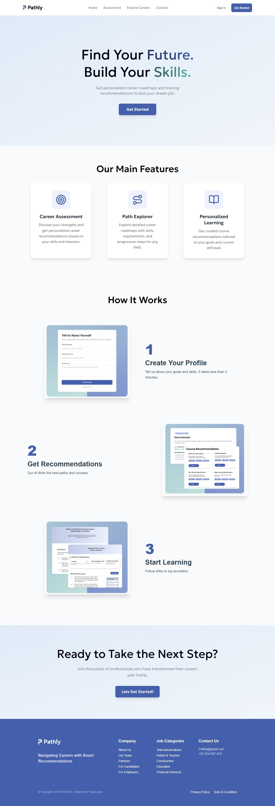
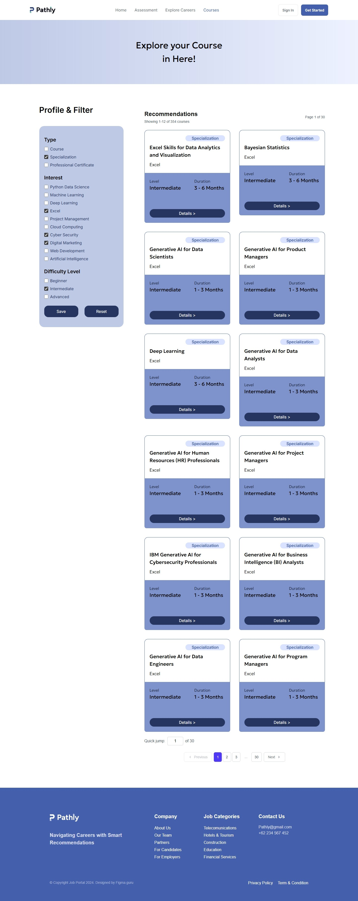
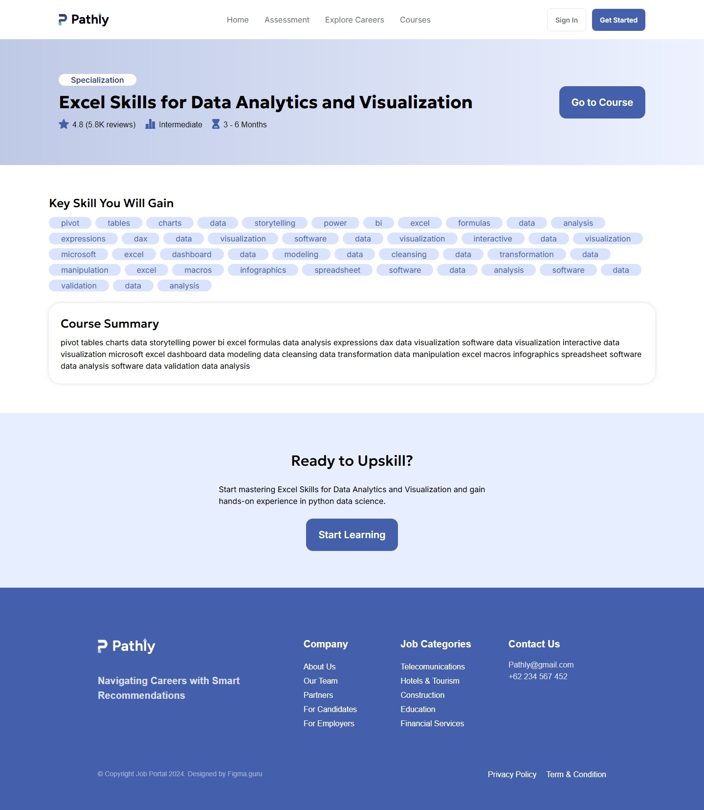

# Pathly

> This project was developed for SISTECH 2025 Front-End Engineering Final Project.

## Project Overview

**Pathly** is a career-compass web app where users can explore lists of recommended courses, certification, and specialization. Currently optimized for desktop use only, the project demonstrate foundational front-end engineering practices using **Next.js** and **Typescript**.

## Web Preview

### Landing Page


### Courses Page


### Course Detail Page



## Technologies Used

- Framework: Next.js (App Router)
- Styling: Tailwind CSS
- Image Handling: next/image

## Update History

| Date          | Description                       | 
|---------------|-----------------------------------|
| 25 Jul 2025   | Initial Next.js project setup     |
| 31 Jul 2025   | First version done and deployed   |

## Future Enhancements

- [ ] Connect to API
- [ ] User Profile & Onboarding
  - [ ] Sign In
  - [ ] Sign Up
- [ ] Career Path Explorer
  - [ ] Career roadmap
  - [ ] Skill requirements
  - [ ] Progression tracking
- [ ] Self-Assessment Quiz
- [ ] Advanced Analytics & Reporting
  - [ ] Dashboard integration
- [ ] Add mobile responsiveness
- [ ] Enhance overall user experience

## How to Run

Open the [deployed web app](pathly-five.vercel.app) in Chrome or any web browser,

or

Run it locally:

1. Clone the repository:
```bash
    git clone https://github.com/arisarae/pathly.git
```

2. Navigate to the project directory:
    
```bash
    cd pathly
```

3. Install dependencies
```bash
    npm install
    # or
    yarn install
```

4. Run the development server
```bash
    npm run dev
    # or
    yarn dev
```

5. Open [http://localhost:3000](http://localhost:3000) in Chrome or any web browser. 

## Contributing

Feel free to fork this repository and make a pull requests.
For major changes, please open an issue first to discuss what you would like to change.

## Contact

Created by [Arisa Rae](linkedin.com/in/arisa-raezzura) and [Izzah Faiq Putri Madani](linkedin.com/in/izzahfaiqputri) - feel free to cennect and contact us!